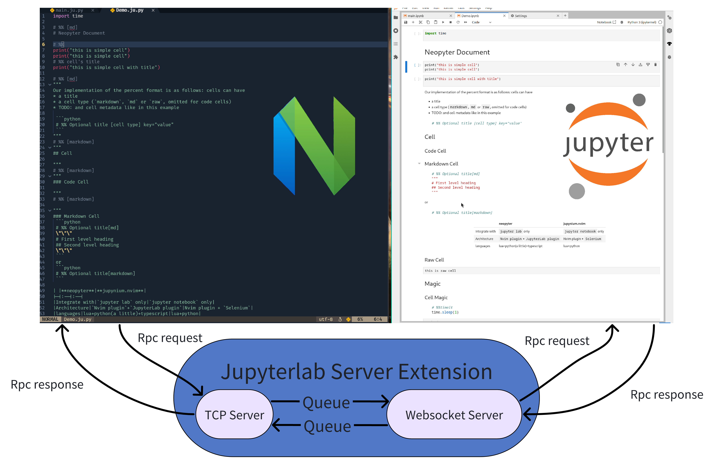
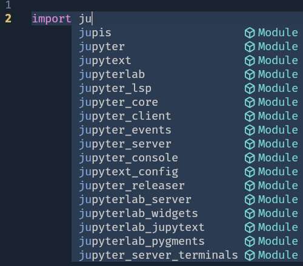
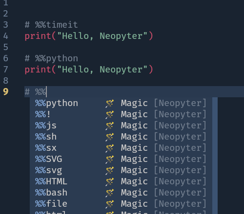

# JupyterLab + Neovim

- A JupyterLab extension.
- A Neovim plugin

## How does it work?



The `Jupyter lab`'s frontend plugin provides RPC service which expose functions of `Jupyter lab`, Jupyterlab server
forward these RPC service by TCP Server. `Neovim`s plugin connect to TCP Server and call RPC service when receive events
from `Neovim` via `autocmd`. In the end, `Neopyter` can control `Juppyter lab`. `Neopyter` can implement more ability like [jupynium.nvim](https://github.com/kiyoon/jupynium.nvim), but better performance.

## Screenshots

|                    Completion                     |                    Cell Magic                     |                    Line Magic                     |
| :-----------------------------------------------: | :-----------------------------------------------: | :-----------------------------------------------: |
|  |  |  |

## Installation

### Requirements

- 📔JupyterLab >= 4.0.0
- ✌️ Neovim >= 9.0
  - 👍`nvim-lua/plenary.nvim`

### JupyterLab Extension

To install the jupyterlab extension, execute:

```bash
pip install neopyter
```

To remove the extension, execute:

```bash
pip uninstall neopyter
```

### Neovim plugin

With 💤lazy.nvim:

```lua
{
    "SUSTech-data/neopyter",
    opts = {
        auto_attach = true,
        -- your jupyter host + neopyter port
        remote_address = "127.0.0.1:9001",
        file_pattern = { "*.ju.*" },
    },
}
```

## Quick Start

- Open JupyterLab `jupyter lab`, there is a sidebar named `Neopyter`, which display neopyter ip+port
- Open a `*.ju.py` file in neovim
- [Optional] if `auto_attach` is `false`, you can connect jupyterlab manually via `:Neopyter connect 127.0.0.1:9001`
- Now you can type `# %%` in Neovim to create a code cell.
  - You'll see everything you type below that will be synchronised in the browser

### Available Vim Commands

- Server
  - `:Neopyter connect [remote 'ip:port']`, e.g. `:Neopyter command 127.0.0.1:9001`, connect `Jupyter lab` manually
  - `:Neopyter disconnect`
  - `:Neopyter status` alias to `:checkhealth neopyter` currently
- Sync

  - `:Neopyter sync current`, make sync current `*.ju.*` file with the currently open `*.ipynb`
  - `:Neopyter sync [filename]`, e.g. `:Neopyter sync main.ipynb`

- Run

  - `:Neopyter run current`, same as `Run`>`Run Selected Cell and Do not Advance` menu in `Jupyter lab`
  - `:Neopyter run allAbove`, same as `Run`>`Run All Above Selected Cell` menu in `Jupyter lab`
  - `:Neopyter run allBelow`, same as `Run`>`Run Selected Cell and All Below` menu in `Jupyter lab`
  - `:Neopyter run all`, same as `Run`>`Run All Cells` menu in `Jupyter lab`

- Kernel

  - `:Neopyter kernel restart`, same as `Kernel`>`Restart Kernel` menu in `Jupyter lab`
  - `:Neopyter kernel restartRunAll`, same as `Kernel`>`Restart Kernel and Run All Cells` menu in `Jupyter lab`

- Jupyter
  - `:Neopyter execute [command_id] [args]`, execute `Jupyter lab`'s [command](https://jupyterlab.readthedocs.io/en/stable/user/commands.html#commands-list) directly, e.g. `:Neopyter execute notebook:export-to-format {"format":"html"}`

### API

`Neopyter` provides rich lua APIs

- Jupyter Lab

  - `Neopyter execute ...` <-> `require("neopyter.jupyter").jupyterlab:execute_command(...)`
  - All APIs see `:lua =require("neopyter.jupyter.jupyterlab").__injected_methods`

- Notebook
  - `:Neopyter run current` <-> `require("neopyter.jupyter").notebook:run_selected_cell()`
  - `:Neopyter run allAbove` <-> `require("neopyter.jupyter").notebook:run_all_above()`
  - `:Neopyter run allBelow` <-> `require("neopyter.jupyter").notebook:run_all_below()`
  - All APIs see `:lua =require("neopyter.jupyter.notebook").__injected_methods`

## Features

- Neovim
  - [x] Full sync
  - [x] Partial sync
  - [x] Scroll view automatically
  - [x] Activate cell automatically
  - [x] Save notebook automatically
  - Completion
    - [x] Magic completion item
    - [x] Path completion item
    - [ ] Disable others?
  - Kernel manage
    - [x] Restart kernel
    - [x] Restart kernel and run all
  - Run cell
    - [x] Run selected cell
    - [x] Run all above selected cell
    - [x] Run selected cell and all below
    - [x] Run all cell
  - Sync
    - [x] Set synchronized `.ipynb` manually
  - Notebook manager
    - [x] Open corresponding notebook if exists
    - [x] Sync with untitled notebook default
    - [ ] Close notebook when buffer unload
- Jupyter Lab
  - Settings
    - [x] Tcp server host/port settings
  - Status [Sidebar](https://jupyterlab.readthedocs.io/en/stable/user/interface.html#left-and-right-sidebar)
    - [x] Display `ip:port`
    - [ ] Display client info
- Performance
  - [x] Rewrite `RpcClient`, support async rpc request
        `vim.rpcrequest` and `vim.rpcnotify`
- Document
  - [ ] API Document

## Acknowledges

- [jupynium.nvim](https://github.com/kiyoon/jupynium.nvim): Selenium-automated Jupyter Notebook that is synchronised with NeoVim in real-time.

## Contributing

### JupyterLab Extension

#### Development install

Note: You will need `NodeJS` to build the extension package. Recommend use `pnpm`

```bash
# Clone the repo to your local environment
# Change directory to the current project directory
# Install package in development mode
pip install -e "."
# Link your development version of the extension with JupyterLab
jupyter labextension develop . --overwrite
# Rebuild extension Typescript source after making changes
pnpm build
```

You can watch the source directory and run JupyterLab at the same time in different terminals to watch for changes in the extension's source and automatically rebuild the extension.

```bash
# Watch the source directory in one terminal, automatically rebuilding when needed
pnpm watch
# Run JupyterLab in another terminal
jupyter lab
```

With the watch command running, every saved change will immediately be built locally and available in your running JupyterLab. Refresh JupyterLab to load the change in your browser (you may need to wait several seconds for the extension to be rebuilt).

By default, the `pnpm build` command generates the source maps for this extension to make it easier to debug using the browser dev tools. To also generate source maps for the JupyterLab core extensions, you can run the following command:

```bash
jupyter lab build --minimize=False
```

#### Development uninstall

```bash
pip uninstall neopyter
```

In development mode, you will also need to remove the symlink created by `jupyter labextension develop`
command. To find its location, you can run `jupyter labextension list` to figure out where the `labextensions`
folder is located. Then you can remove the symlink named `neopyter` within that folder.

#### Testing the extension

##### Frontend tests

This extension is using [Jest](https://jestjs.io/) for JavaScript code testing.

To execute them, execute:

```sh
pnpm install
pnpm test
```

##### Integration tests

This extension uses [Playwright](https://playwright.dev/docs/intro) for the integration tests (aka user level tests).
More precisely, the JupyterLab helper [Galata](https://github.com/jupyterlab/jupyterlab/tree/master/galata) is used to handle testing the extension in JupyterLab.

More information are provided within the [ui-tests](./ui-tests/README.md) README.

#### Packaging the extension

See [RELEASE](RELEASE.md)
