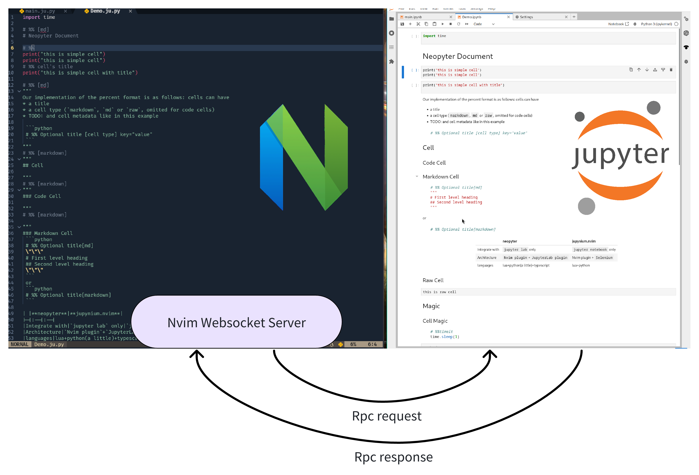
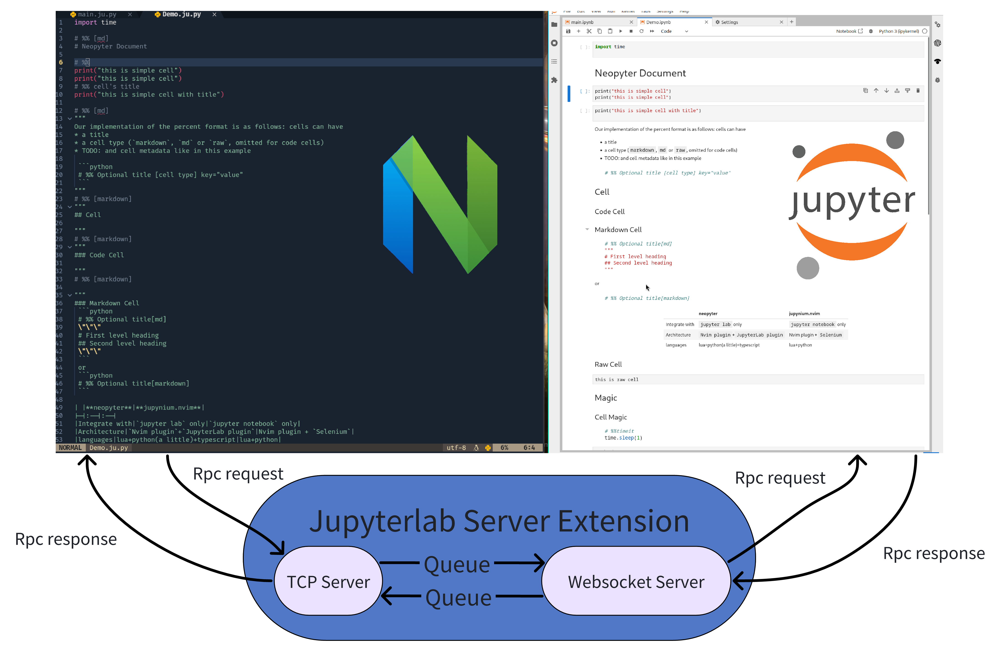
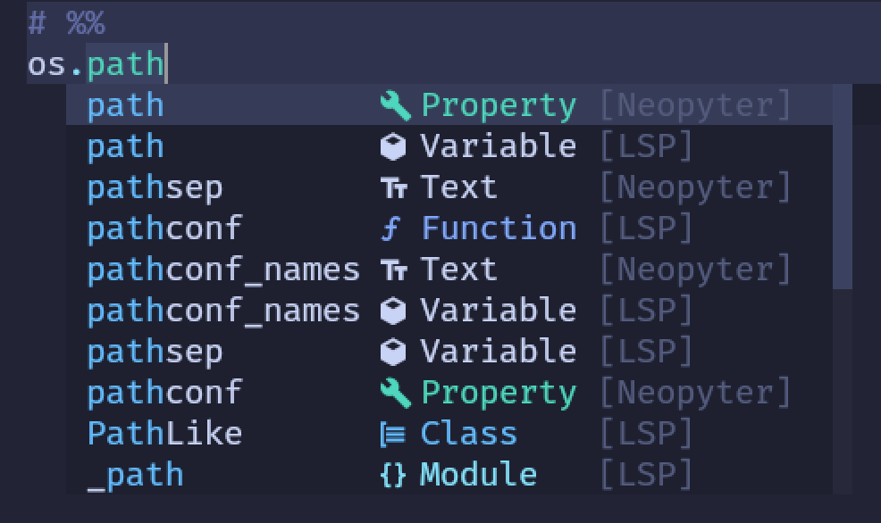
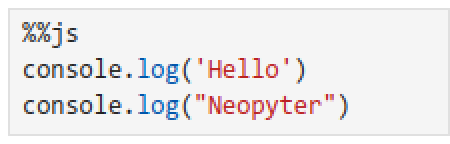
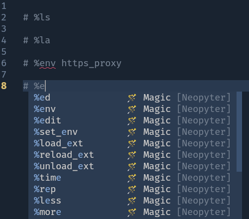
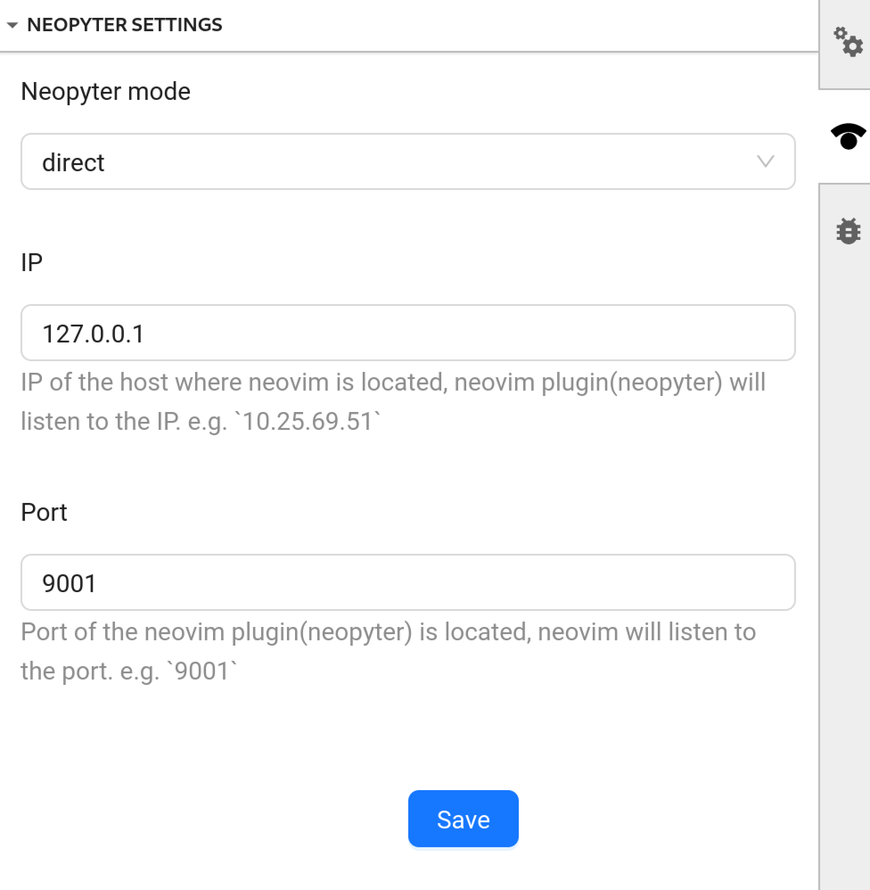

# Introduction

The bridge between Neovim and Jupyter Lab, edit in Neovim and preview/run in Jupyter Lab.

## How does it work?

This project includes two parts: a [`JupyterLab extension`](https://jupyterlab.readthedocs.io/en/stable/user/extensions.html) and a Neovim plugin

- The `JupyterLab extension` exposes functions of `Jupyter lab`, and provides a remote procedure call(RPC) service
- The `Neovim plugin` calls the RPC service when it receives events from `Neovim` via `autocmd`

This project provides two work modes for different network environments. If the browser where your jupyter lab is
located cannot directly access nvim, you must use `proxy` mode; If you need to collaborate and use the same Jupyter with
others, you must use direct mode

<table>
    <tr>
        <th></th>
        <th>direct</th>
        <th>proxy</th>
    </tr>
    <tr>
        <th>Architecture</th>
        <th style="text-align:center">
            
        </th>
        <th>
            
        </th>
    </tr>
    <tr>
        <th>Advantage</th>
        <th style="text-align:left;font-weight:lighter">
            <ul>
                <li>Lower communication costs</li>
                <li>Shareable JupyterLab instance</li>
            </ul>
        </th>
        <th style="text-align:left;font-weight:lighter">
            <ul>
                <li>Lower Neovim load</li>
            </ul>
        </th>
    </tr>
    <tr>
        <th>Disadvantage</th>
        <th style="text-align:left;font-weight:lighter">
            <ul>
                <li>Higher Neovim load</li>
            </ul>
        </th>
        <th style="text-align:left;font-weight:lighter">
            <ul>
                <li>Exclusive JupyterLab instance</li>
            </ul>
        </th>
    </tr>
</table>

- `direct` mode: (default, recommended) In this mode, neovim is server and neovim plugin(neopyter) is listening to `remote_address`,
  the browser where jupyter lab is located will connect to neovim

- `proxy` mode: In this mode, Jupyter lab server(server side, the host you run `jupyter lab` to start JupyterLab) is server
  and jupyter lab server extension(neopyter) is listening to ``{IP}:{Port}`, the neovim plugin(neopyter) will connect to ``{IP}:{Port}`

Ultimately, `Neopyter` can control `Juppyter lab`. `Neopyter` can implement abilities like [jupynium.nvim](https://github.com/kiyoon/jupynium.nvim).

## Specifications

Please refer to [doc/specification.ipynb](doc/specification.ipynb) and [doc/specification.ju.py](doc/specification.ju.py)

<!-- panvimdoc-ignore-start -->
## Screenshots

<table>
    <tr>
        <th></th>
        <th>[Completion](#blinkcmp)</th>
        <th>Cell Magic</th>
        <th>Line Magic</th>
    </tr>
    <tr>
        <th>
        </th>
        <th>
            
        </th>
        <th>
            
        </th>
        <th>
            
        </th>
    </tr>
</table>
<!-- panvimdoc-ignore-end -->

# Requirements

- 📔JupyterLab >= 4.0.0
- ✌️ Neovim latest
  - 👍`nvim-lua/plenary.nvim`
  - 🤏`AbaoFromCUG/websocket.nvim` (optional for `mode="direct"`)

# Installation

`Neopyter` support two parts, so we need to install them separately.

## JupyterLab Extension

To install the jupyterlab extension, execute:

```bash
pip install neopyter
```

Configure `JupyterLab` in side panel


- `mode`: Refer to the previous introduction about mode
- `IP`: If `mode=proxy`, set to the IP of the host where jupyter server is located. If `proxy=direct`, set to the IP of the
  host where neovim is located
- `Port`: Idle port of the `IP`'s' host

*NOTICE:* all settings is saved to localStorage

## Neovim Plugin

- With 💤lazy.nvim:

```lua
{
    "SUSTech-data/neopyter",
    ---@type neopyter.Option
    opts = {
        mode="direct",
        remote_address = "127.0.0.1:9001",
        file_pattern = { "*.ju.*" },
        on_attach = function(bufnr)
            -- do some buffer keymap
        end,
    },
}
```

<details>
<summary><strong>Default configuration</strong></summary>

<!-- doc-inject:default-config -->
```lua
---@type neopyter.Option
local default_config = {
    remote_address = "127.0.0.1:9001",
    file_pattern = { "*.ju.*" },
    filename_mapper = function(ju_path)
        local ipynb_path = vim.fn.fnamemodify(ju_path, ":r:r:r") .. ".ipynb"
        return ipynb_path
    end,
    --- auto attach to buffer
    auto_attach = true,
    --- auto connect with remote jupyterlab
    auto_connect = true,
    mode = "direct",
    ---@type neopyter.JupyterOption  # ref `:h neopyter.JupyterOption`
    jupyter = {
        auto_activate_file = true,
        -- Always scroll to the current cell.
        scroll = {
            enable = true,
            align = "center",
        },
    },

    ---@type neopyter.HighlightOption  # ref `:h neopyter.HighlightOption`
    highlight = {
        enable = true,
        mode = "separator",
    },
    ---@type neopyter.TextObjectOption  # ref `:h neopyter.TextObjectOption`
    textobject = {
        enable = true,
        queries = { "cellseparator" },
    },
    ---@type neopyter.InjectionOption  # ref `:h neopyter.InjectionOption`
    injection = {
        enable = true,
    },
    ---@type neopyter.ParserOption  # ref `:h neopyter.ParserOption`
    parser = {
        trim_whitespace = false,
        python = {},
    },
}
```

</details>

See `:h neopyter-configuration-types` for all option type description.

Suggest keymaps(`neopyter` don't provide default keymap):

```lua
on_attach = function(buf)
    local function map(mode, lhs, rhs, desc)
        vim.keymap.set(mode, lhs, rhs, { desc = desc, buffer = buf })
    end
    -- same, recommend the former
    map("n", "<C-Enter>", "<cmd>Neopyter execute notebook:run-cell<cr>", "run selected")
    -- map("n", "<C-Enter>", "<cmd>Neopyter run current<cr>", "run selected")

    -- same, recommend the former
    map("n", "<space>X", "<cmd>Neopyter execute notebook:run-all-above<cr>", "run all above cell")
    -- map("n", "<space>X", "<cmd>Neopyter run allAbove<cr>", "run all above cell")

    -- same, recommend the former, but the latter is silent
    map("n", "<space>nt", "<cmd>Neopyter execute kernelmenu:restart<cr>", "restart kernel")
    -- map("n", "<space>nt", "<cmd>Neopyter kernel restart<cr>", "restart kernel")

    map("n", "<S-Enter>", "<cmd>Neopyter execute runmenu:run<cr>", "run selected and select next")
    map("n", "<M-Enter>", "<cmd>Neopyter execute run-cell-and-insert-below<cr>", "run selected and insert below")

    map("n", "<F5>", "<cmd>Neopyter execute notebook:restart-run-all<cr>", "restart kernel and run all")
end
```

# Usage

- Open JupyterLab `jupyter lab`, there is a sidebar named `Neopyter`, which display neopyter ip+port
- Open a `*.ju.py` file in neovim
- Now you can type `# %%` in Neovim to create a code cell.
  - You'll see everything you type below that will be synchronised in the browser

# Available Vim Commands

- Status
  - `:Neopyter status` alias to `:checkhealth neopyter` currently
- Server
  - `:Neopyter connect [remote 'ip:port']`, e.g. `:Neopyter command 127.0.0.1:9001`, connect `Jupyter lab` manually
  - `:Neopyter disconnect`
- Sync
  - `:Neopyter sync current`, make sync current `*.ju.*` file with the currently open `*.ipynb`
  - `:Neopyter sync [filename]`, e.g. `:Neopyter sync main.ipynb`
- Run
  - `:Neopyter run current`, same as `Run`>`Run Selected Cell and Do not Advance` menu in `Jupyter lab`
  - `:Neopyter run allAbove`, same as `Run`>`Run All Above Selected Cell` menu in `Jupyter lab`
  - `:Neopyter run allBelow`, same as `Run`>`Run Selected Cell and All Below` menu in `Jupyter lab`
  - `:Neopyter run all`, same as `Run`>`Run All Cells` menu in `Jupyter lab`
- Kernel
  - `:Neopyter kernel restart`, same as `Kernel`>`Restart Kernel` menu in `Jupyter lab`
  - `:Neopyter kernel restartRunAll`, same as `Kernel`>`Restart Kernel and Run All Cells` menu in `Jupyter lab`
- Jupyter
  - `:Neopyter execute [command_id] [args]`, execute `Jupyter lab`'s
    [command](https://jupyterlab.readthedocs.io/en/stable/user/commands.html#commands-list)
    directly, e.g. `:Neopyter execute notebook:export-to-format {"format":"html"}`

# Integration

## neoconf.nvim

If [neoconf.nvim](https://github.com/SUSTech-data/neopyter) is available, `neopyter` will automatically register/read `neoconf` settings

[`.neoconf.json`](./.neoconf.json)

```json
{
  "neopyter": {
    "mode": "proxy",
    "remote_address": "127.0.0.1:9001"
  }
}
```

## nvim-cmp

- `nvim-cmp`
- `lspkind.nvim`

```lua

local lspkind = require("lspkind")
local cmp = require("cmp")

cmp.setup({
    sources = cmp.config.sources({
        -- default: all source, maybe some noice
        { name = "neopyter" },

        -- { name = "neopyter", option={ source = { "CompletionProvider:kernel" } } },
    }),
    formatting = {
        format = lspkind.cmp_format({
            mode = "symbol_text",
            menu = {
                buffer = "[Buf]",
                nvim_lsp = "[LSP]",
                nvim_lua = "[Lua]",
                neopyter = "[Neopyter]",
            },
            symbol_map = {
                -- specific complete item kind icon
                ["Magic"] = "🪄",
                ["Path"] = "📁",
                ["Dict key"] = "🔑",
                ["Instance"] = "󱃻",
                ["Statement"] = "󱇯",
            },
        }),
    },
)}

    -- menu item highlight
vim.api.nvim_set_hl(0, "CmpItemKindMagic", { bg = "NONE", fg = "#D4D434" })
vim.api.nvim_set_hl(0, "CmpItemKindPath", { link = "CmpItemKindFolder" })
vim.api.nvim_set_hl(0, "CmpItemKindDictkey", { link = "CmpItemKindKeyword" })
vim.api.nvim_set_hl(0, "CmpItemKindInstance", { link = "CmpItemKindVariable" })
vim.api.nvim_set_hl(0, "CmpItemKindStatement", { link = "CmpItemKindVariable" })

```

More information, see [nvim-cmp wiki](https://github.com/hrsh7th/nvim-cmp/wiki/Menu-Appearance)

## blink.cmp

- `blink.cmp`

```lua
require("blink-cmp").setup({
    sources = {
        default = {
            "neopyter",
        },
        providers = {
            neopyter = {
                name = "Neopyter",
                module = "neopyter.blink",
                ---@type neopyter.CompleterOption
                opts = {},
            },
        },
    },
})

```

## textobjects

Supported captures in `textobjects` query group

- `@cell`
  - `@cell.code`
  - `@cell.magic`
  - `@cell.markdown`
  - `@cell.raw`
- `@cellseparator`
  - `@cellseparator.code`
  - `@cellseparator.magic`
  - `@cellseparator.markdown`
  - `@cellseparator.raw`
- `@cellbody`
  - `@cellbody.code`
  - `@cellbody.magic`
  - `@cellbody.markdown`
  - `@cellbody.raw`
- `@cellcontent`
  - `@cellcontent.code`
  - `@cellcontent.magic`
  - `@cellcontent.markdown`
  - `@cellcontent.raw`
- `@cellborder`
  - `@cellborder.start`
    - `@cellborder.start.markdown`
    - `@cellborder.start.raw`
  - `@cellborder.end`
    - `@cellborder.end.markdown`
    - `@cellborder.end.raw`
- `@linemagic`

```lua
require'nvim-treesitter.configs'.setup {
    textobjects = {
        move = {
            enable = true,
            goto_next_start = {
                ["]j"] = "@cellseparator",
            },
            goto_previous_start = {
                ["[j"] = "@cellseparator",
            },
        },
    },
}

```

# API

`Neopyter` provides rich lua APIs, you could use below code as initialization:

```lua

-- Reference to `:h neopyter-jupyterlab-api` for all api document
local current_lab = require("neopyter.jupyter").jupyterlab
current_lab:execute_command("notebook:export-to-format", {format="html"})

-- Reference to `:h neopyter-notebook-api` for all api document
local current_notebook = require("neopyter.jupyter").notebook

current_notebook:run_selected_cell()
current_notebook:run_all_above()
current_notebook:run_all_below()

```

- Notebook API: `:h neopyter-notebook-api`
- JupyterLab API`:h neopyter-jupyterlab-api-api`

## Async

`Notebook` and `JupyterLab` APIs are wrapped by async context automatically.

- If you call api from async context, anything is OK. Otherwise, the calling order cannot be guaranteed
- A single API call always works

```lua
vim.defer_fn(function()
    -- non-async context, API response may be unordered
    current_notebook:run_selected_cell()
    current_notebook:run_all_above()
    current_notebook:run_all_below()
end, 0)

require("neopyter.async").run(function()
    -- async context, so which will call and return in order
    current_notebook:run_selected_cell()
    current_notebook:run_all_above()
    current_notebook:run_all_below()
end)

```

# Features

- Neovim
  - [x] Full sync
  - [x] Partial sync
  - [x] Scroll view automatically
  - [x] Activate cell automatically
  - [x] Save notebook automatically
  - Completion
    - [x] Magic completion item
    - [x] Path completion item
  - Tree-sitter
    - [x] Highlight
      - Separator+non-code
      - Shortsighted
    - [x] Textobjects
    - [ ] Fold
  - Kernel management
    - [x] Restart kernel
    - [x] Restart kernel and run all
  - Run cell
    - [x] Run selected cell
    - [x] Run all above selected cell
    - [x] Run selected cell and all below
    - [x] Run all cell
  - Sync
    - [x] Set synchronized `.ipynb` manually
  - Notebook manager
    - [x] Open corresponding notebook if exists
    - [x] Sync with untitled notebook default
    - [ ] Close notebook when buffer unload
- Jupyter Lab
  - Settings
    - [x] TCP server host/port settings
  - Status [Sidebar](https://jupyterlab.readthedocs.io/en/stable/user/interface.html#left-and-right-sidebar)
    - [x] Settings `ip:port`
    - [ ] Display client info
- Performance
  - [x] Rewrite `RpcClient`, support async RPC request
        `vim.rpcrequest` and `vim.rpcnotify`
  - [x] Rewrite `highlights` and `textobjects` queries
  - [x] Rewrite parser with tree-sitter
  - [x] Unified `highlights`, `textobjects`, `parser` to unified parser
- Document
  - [x] API Document

# Acknowledges

- [jupynium.nvim](https://github.com/kiyoon/jupynium.nvim): Selenium-automated Jupyter Notebook that is synchronised with Neovim in real-time.
- [snacks.nvim](https://github.com/folke/snacks.nvim): The `zen` highlight is inspired by `snacks.zen`

<!-- panvimdoc-include-comment

# Configuration Types
This will be replaced by gen_doc.lua

-->
